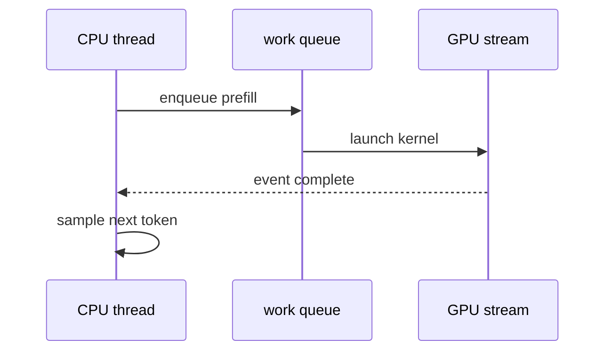
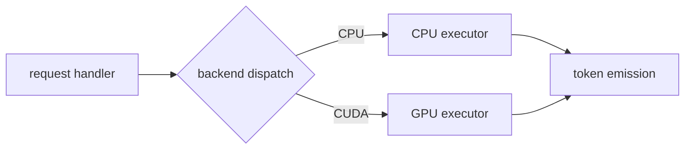

Help the user understand systems, runtimes, and inference engines visually. Skip the preamble and keep prose brief. Pick the smallest view that makes the key point clear. Prefer source-faithful diagrams over generic architecture art.

- Show a request or execution lifecycle as a call tree or sequence diagram. Include the real entry point, dispatch, scheduling, backend, kernel or worker boundary, state handoff, and response/emission path when present:

```text
HTTP handler
  parse request
  dispatch
    scheduler / queue
    prefill
      backend dispatch
        CUDA kernel
    decode loop
      sampler
      token emission
  complete response
```

- Show a systems boundary with ownership and transport made explicit:

```text
process A                  shared memory / IPC                 process B
request queue ───────────▶ ring buffer ─────────────────────▶ worker
owns request                       borrows weights                  owns response
```

- Show memory, state, or lifetime as a compact state diagram. Make allocations, owners, borrowed views, transfers, cache keys, invalidation, and release points visible when they matter:

```text
weights: load ─▶ resident ─▶ shared ─▶ released
KV cache: empty ─▶ prefilling ─▶ decoding ─▶ evicted
buffer: allocated(owner=A) ─▶ borrowed(B) ─▶ returned ─▶ freed(A)
```

- For concurrency, show threads, processes, devices, queues, locks, events, streams, backpressure, and synchronization edges. Distinguish the critical path from parallel work:



- For inference engines, default to the request-to-token path when relevant:

```text
request
  parse / validate
  model + runtime state
  prefill ──▶ KV cache
  decode loop
    forward pass
    logits
    sampling
    token emission
```

  Add tensor shapes, layer placement, batching, cache reads/writes, synchronization, or CPU/GPU/remote boundaries only when the source supports them.

- Show backend or dispatch selection as a decision flow. Make CPU, CUDA, HIP, Metal, remote, fallback, and layer-split branches explicit instead of collapsing them into “backend.”

- Show performance questions as a critical-path diagram or timeline. Mark synchronization, serialization, memory movement, queue waits, kernel launches, and likely bottlenecks; label hypotheses as hypotheses.

- Use file and symbol names on nodes, with line references when available. Keep only the calls, buffers, states, types, devices, and boundaries needed to answer the current question. Do not invent unseen edges or claim a kernel/device/ownership relationship without source evidence; mark uncertainty as `?` or “inferred.”

- Use Mermaid for call flow, sequence, state, dependency, and concurrency diagrams:



- Use a shallow file tree when the question is about module responsibility or a broad refactor:

```text
src/
├── http_server/      # request parsing and response streaming
├── scheduler/        # queues, batching, admission
├── runtime/          # state and cache ownership
├── backends/         # CPU/GPU dispatch
└── kernels/          # device operations
```

- Use `diff` when the point is what changes and the surrounding shape already exists. Match the diff to the topic:

```diff
 request_handler
   parse_request
+  enqueue_with_backpressure
   dispatch_backend
     prefill
     decode
-      emit_token
+      sample_token
+      emit_token
```

- Show the whole code block only when most of it is new, omitted context would hide ownership or ordering, or the user needs a copyable target shape. Otherwise show signatures, types, pseudocode, or the smallest relevant excerpt.

- For a visual UI, state comparison, dense dependency map, or concept that Mermaid cannot make legible, write one focused HTML file: a diagram, timeline, memory map, or short slide deck. Use real labels and source-derived data, keep it readable on desktop and mobile, and open it for the user:

```text
Bash(open path/to/show-me-{description}.html)
```

- Place each visual next to the short text it supports. Use one visual by default; add another only when it explains a different relationship. Avoid walls of prose, generic boxes, and visuals that imply more certainty or detail than the code provides.
